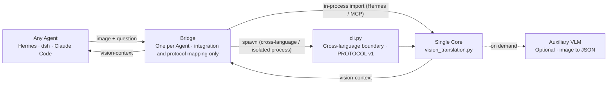

# Translation with Visual Primitives

> **One stable visual-translation Core; any Agent can plug in through a Bridge.**

> **一个稳定的视觉翻译 Core，任意 Agent 都可以通过 Bridge 即插即用。**

This project turns an image into structured `<vision-context>` text. An auxiliary VLM looks at the image, while the Core produces `norm-1000 xyxy` visual primitives, computes spatial relations from geometry, and extracts OCR. The main Agent consumes text only: it does not handle pixels and does not need a model change.

本项目把图片转换成结构化的 `<vision-context>` 文本：辅助 VLM 负责看图，Core 统一生成 `norm-1000 xyxy` 视觉基元、由几何计算空间关系并提取 OCR。主 Agent 只消费文本，不接触像素，也不需要修改模型。

The name intentionally echoes DeepSeek's paper [*Thinking with Visual Primitives*](https://arxiv.org/abs/2508.12952). The paper puts visual primitives inside a model; this project reverses the direction by translating vision into primitives outside the model and handing them to an ordinary text model.

项目名有意呼应 DeepSeek 的论文 [*Thinking with Visual Primitives*](https://arxiv.org/abs/2508.12952)。论文让模型在内部使用视觉基元，本项目则把方向反过来：在模型外部把视觉翻译成基元，再交给原本的文本模型。

## Architecture: one Core, any Agent, one Bridge each

## 架构：一个 Core，任意 Agent，各自的 Bridge



The call direction is a round trip: the Core calls the auxiliary VLM, the Bridge calls the Core, and the final `<vision-context>` returns through the Bridge to the Agent. A Python Bridge may import the Core directly; other languages and isolated processes use `cli.py` and PROTOCOL v1.

图中的调用在实现上是往返的：Core 调用辅助 VLM，Bridge 调用 Core，最终 `<vision-context>` 经 Bridge 返回 Agent。Python Bridge 可以直接导入 Core，其他语言和隔离进程通过 `cli.py` 与 PROTOCOL v1 调用。

```text
vision_translation.py   Core: the only visual-translation logic; import-pure
cli.py                  Cross-language protocol entry point: argv/stdin → one JSON object
__init__.py             Hermes native Bridge (in-process)
adapters/mcp/           Generic MCP Bridge (imports the Core in-process)
adapters/_template/     Community Bridge template (uses the CLI)
```

**The Core does not change for each Agent.** A new integration contributes a thin Bridge that passes the host image and question to the existing Core and maps the result back. A Bridge must not duplicate prompts, JSON parsing, box normalization, relation calculation, or VLM calls.

**核心不随 Agent 改变。** 新接入只需贡献一个薄 Bridge，把宿主的图片和问题交给既有 Core，再把结果映射回宿主。Bridge 不得复制提示词、JSON 解析、框归一化、关系计算或 VLM 调用逻辑。

## Quick start

## 快速开始

### Direct CLI usage

### 直接使用 CLI

The Core needs only the Python standard library at runtime. Pillow is optional for image rotation and resizing.

Core 运行时仅依赖 Python 标准库；Pillow 是可选的图片旋转和缩放增强。

```bash
export OPENROUTER_API_KEY=sk-...
python cli.py path/to/image.jpg "What is the layout?"
```

stdout always contains exactly one JSON object; logs belong on stderr:

stdout 始终只有一个 JSON 对象；日志只能写入 stderr：

```json
{
  "protocol": 1,
  "core_version": "<core_version>",
  "status": "ok",
  "context": "<vision-context>…</vision-context>",
  "model": "xiaomi/mimo-v2.5"
}
```

`<core_version>` is a placeholder. The real value comes from `python cli.py --protocol-version`, and CI checks it against `plugin.yaml`.

示例中的 `<core_version>` 是占位符；实际值以 `python cli.py --protocol-version` 输出为准，CI 会检查它与 `plugin.yaml` 一致。

The three statuses are:

三种 `status` 是：

- `ok`: visual context was generated; exit code 0.
- `unavailable`: an expected fail-closed condition such as a missing key, upstream outage, or invalid VLM output; exit code 0.
- `error`: invalid request or internal error; exit code 1–2.

- `ok`：已得到视觉上下文，退出码 0。
- `unavailable`：无密钥、上游不可用或 VLM 输出无效等可预期降级，退出码 0。
- `error`：请求错误或内部错误，退出码 1–2。

See [PROTOCOL.md](PROTOCOL.md) for the complete contract. These read-only handshakes do not read images, use tokens, or access the network, so they are suitable for CI:

完整契约见 [PROTOCOL.md](PROTOCOL.md)。以下握手命令不读取图片、不使用 Token、不访问网络，适合 CI：

```bash
python cli.py --self-check
python cli.py --protocol-version
```

### Hermes native Bridge

### Hermes Agent 原生 Bridge

The Hermes native plugin requires an `OPENROUTER_API_KEY` configured for Hermes:

Hermes 原生插件需要为 Hermes 配置 `OPENROUTER_API_KEY`：

```bash
# Recommended: install from GitHub
hermes plugins install BingL-Li/vision-translation --enable

# Or place it in the user plugin directory
git clone https://github.com/BingL-Li/vision-translation ~/.hermes/plugins/vision-translation
hermes plugins enable vision-translation
```

Restart the Hermes process that hosts the conversation, then verify the plugin and tool:

重启承载对话的 Hermes 进程，再验证插件和工具：

```bash
hermes plugins list
hermes tools list
```

The `vision_translate` tool in the `vision_translation` toolset accepts:

`vision_translation` toolset 中的 `vision_translate` 工具参数如下：

| Parameter | Type | Description |
|---|---|---|
| `image_path` | string | Required local image path |
| `question` | string | Optional question that focuses the analysis |
| `max_objects` | int | Maximum primitives, default 12 and capped at 16 |

| 参数 | 类型 | 说明 |
|---|---|---|
| `image_path` | string | 本地图片路径，必填 |
| `question` | string | 用于引导解析重点的可选问题 |
| `max_objects` | int | 保留的最大基元数，默认 12、上限 16 |

Use Hermes' built-in `vision_analyze` for a cheap one-sentence description. Use `vision_translate` when you need coordinates, counts, relative positions, UI/PCB element locations, structured entities, or OCR.

只需一句廉价描述时使用 Hermes 内置 `vision_analyze`；需要坐标、计数、相对位置、UI/PCB 元素位置、结构化实体或 OCR 时使用 `vision_translate`。

### MCP Bridge

### MCP Bridge

The MCP Bridge works with dsh, Claude Code, Cursor, Hermes, Codex, and any other MCP Host:

MCP Bridge 适用于 dsh、Claude Code、Cursor、Hermes、Codex 以及任意 MCP Host：

```bash
cd adapters/mcp
python -m venv .venv
.venv/bin/pip install -r requirements.txt
.venv/bin/python smoke_test.py
```

Configure `adapters/mcp/server.py` as a stdio MCP Server. dsh can merge `adapters/mcp/dsh-preset.yml`; Claude Code and Cursor use `.mcp.json` and `~/.cursor/mcp.json`. See [adapters/mcp/README.md](adapters/mcp/README.md) for complete configuration.

随后把 `adapters/mcp/server.py` 配置为 stdio MCP Server。dsh 可合并 `adapters/mcp/dsh-preset.yml`；Claude Code 和 Cursor 分别使用 `.mcp.json` 和 `~/.cursor/mcp.json`。完整配置见 [adapters/mcp/README.md](adapters/mcp/README.md)。

Hermes users should choose either the native plugin or the MCP Bridge, not both, to avoid duplicate tools.

Hermes 用户应在原生插件与 MCP Bridge 中二选一，避免注册两个用途相同的工具。

### End-to-end demo

### 端到端 Demo

```bash
python demos/vision_translate_demo.py path/to/image.jpg "What is the layout?"
```

The demo additionally sends `<vision-context>` to a text LLM. Production integrations need only Bridge + Core; the Core itself does not nest a text-LLM call.

Demo 额外演示把 `<vision-context>` 交给文本 LLM；生产集成只需 Bridge + Core，Core 本身不会嵌套调用文本 LLM。

### Add a Bridge for another Agent

### 为其他 Agent 增加 Bridge

```bash
cp -r adapters/_template adapters/<your-agent>
```

Implement the host integration, add a README and offline smoke test, register it in [ADAPTERS.md](ADAPTERS.md), and submit a PR. The full process is in [CONTRIBUTING.md](CONTRIBUTING.md).

实现宿主接入、补充 README 和离线 smoke test、登记到 [ADAPTERS.md](ADAPTERS.md)，即可提交 PR。详细流程见 [CONTRIBUTING.md](CONTRIBUTING.md)。

## Data flow

## 数据流

1. The Bridge receives an image path, question, and optional parameters from the Agent.
2. The Core applies EXIF orientation and, when Pillow is available, limits the long edge to 1568 pixels.
3. The Core sends the image to the configurable OpenRouter auxiliary VLM (default `xiaomi/mimo-v2.5`, override with `VISION_TRANSLATE_VLM`).
4. The Core parses JSON defensively, validates and normalizes object boxes, clamps out-of-range coordinates with warnings, and drops zero-area or non-finite boxes.
5. The Core computes `left_of / right_of / above / below / inside / overlaps` from geometry instead of asking the VLM to guess.
6. The Core renders a `<vision-context>` of at most 2000 characters, preserving primitives and relations first and trimming descriptions when necessary.
7. The Bridge maps success, unavailable, and error states to results understood by the host Agent.

1. Bridge 接收 Agent 给出的图片路径、问题和可选参数。
2. Core 处理 EXIF 方向，并在 Pillow 可用时将长边限制为 1568 像素。
3. Core 把图片交给可配置的 OpenRouter 辅助 VLM（默认 `xiaomi/mimo-v2.5`，可由 `VISION_TRANSLATE_VLM` 覆盖）。
4. Core 容错解析 JSON，校验并规范化对象框；坐标越界会被钳制并产生警告，零面积或非有限坐标会被丢弃。
5. Core 根据几何关系计算 `left_of / right_of / above / below / inside / overlaps`，而不是让 VLM 猜关系。
6. Core 渲染不超过 2000 字符的 `<vision-context>`；优先保留基元和关系，超限时先裁剪描述文本。
7. Bridge 将成功、不可用或错误状态转换成宿主 Agent 能理解的结果。

## Design boundaries

## 设计边界

- **One coordinate contract:** `norm-1000`, `xyxy`, top-left `(0, 0)`, bottom-right `(1000, 1000)`.
- **Honest grounding:** coordinates are prompted by the VLM, not emitted by a native detector, and are marked `grounding: prompted`.
- **Geometry over language:** directional relations require clear separation by `EPS=20`; containment and overlap also come from boxes.
- **Fail closed:** after three invalid VLM outputs, return `unavailable`; never inject plausible empty context or fabricated content. Up to three image requests may be sent on this path.
- **Testable Core:** importing `vision_translation.py` performs no network request, argparse work, or output; HTTP at the VLM boundary can be mocked.
- **Extensible Bridge:** host lifecycle, attachment format, and tool protocol belong to Bridges; visual semantics, parsing, and geometry belong to the Core.
- **Privacy boundary:** images are sent to the configured OpenRouter VLM, not the main text model; confirm the data policy for your use case.

- **统一坐标契约：** `norm-1000`、`xyxy`，左上角 `(0, 0)`，右下角 `(1000, 1000)`。
- **诚实 Grounding：** 坐标是 VLM 按提示生成，不是原生检测器输出，因此明确标记为 `grounding: prompted`。
- **几何而非语言关系：** 方向关系只在两个框以 `EPS=20` 明确分离时产生；包含和重叠也由框计算。
- **失败关闭：** 三次无效 VLM 输出后返回 `unavailable`，绝不注入看似合理的空上下文或编造内容；失败路径最多会发送三次带图请求，需留意成本。
- **Core 可测试：** `vision_translation.py` 导入时无网络、无 argparse、无输出；测试可以在 HTTP 边界 Mock VLM。
- **Bridge 可扩展：** 宿主生命周期、附件格式、工具协议属于 Bridge；视觉语义、解析和几何只属于 Core。
- **隐私边界：** 图片会发送到配置的 OpenRouter VLM，不会发送给主文本模型；使用前应确认数据策略满足场景。

## Example output

## 输出示意

```text
<vision-context>
<visual-primitives coord="norm-1000" box_order="xyxy" grounding="prompted">
- v1 | type: box | box: [86, 120, 420, 630] | ref: panel | confidence: 0.96 | grounding: prompted
- v2 | type: box | box: [610, 210, 900, 520] | ref: button | confidence: 0.93 | grounding: prompted
</visual-primitives>
<visual-relations>
- v1 left_of v2 | source: geometry | confidence: 1.0
</visual-relations>
visible_text: Submit
</vision-context>
```

## Repository structure

## 仓库结构

| Path | Role |
|---|---|
| `vision_translation.py` | Single Core |
| `cli.py` | PROTOCOL v1 cross-language entry point |
| `__init__.py` | Hermes native Bridge |
| `adapters/_template/` | Community Bridge scaffold |
| `adapters/mcp/` | Generic MCP Bridge and dsh preset |
| `demos/` | End-to-end demo with a text-LLM step |
| `tests/` | Offline Core and protocol tests |
| `PROTOCOL.md` | Single CLI protocol specification |
| `ADAPTERS.md` | Bridge registry and ecosystem rules |
| `CONTRIBUTING.md` | Contribution process and review boundaries |
| `CHANGELOG.md` | Version history |

| 路径 | 作用 |
|---|---|
| `vision_translation.py` | 唯一 Core |
| `cli.py` | PROTOCOL v1 跨语言入口 |
| `__init__.py` | Hermes 原生 Bridge |
| `adapters/_template/` | 社区 Bridge 脚手架 |
| `adapters/mcp/` | 通用 MCP Bridge 与 dsh preset |
| `demos/` | 含文本 LLM 步骤的端到端演示 |
| `tests/` | 离线 Core 与协议测试 |
| `PROTOCOL.md` | CLI 协议唯一规范 |
| `ADAPTERS.md` | Bridge 注册表与生态规则 |
| `CONTRIBUTING.md` | 贡献流程与审查边界 |
| `CHANGELOG.md` | 版本历史 |

## Limitations

## 局限

- Grounding comes from VLM prompting rather than a native detector: it is useful for layout, UI, and scene understanding, but not guaranteed to be pixel-perfect.
- The selected OpenRouter VLM must support image input; check its `input_modalities` before switching models.
- The main model must reliably understand coordinate text and spatial relations. DeepSeek models were the initial target, but the Core is model-agnostic.
- The MCP Bridge currently accepts local file paths. Hosts that provide only in-memory attachments and no shared filesystem need a native Bridge or attachment conversion.

- Grounding 来自 VLM 提示而非原生检测器，适合布局、UI 和场景理解，但不保证像素级准确。
- 需要支持图片输入的 OpenRouter VLM；更换模型前应核对其 `input_modalities`。
- 主模型需要能可靠理解坐标文本和空间关系；DeepSeek 系列是最初目标，但 Core 与主 Agent 模型无关。
- MCP Bridge 当前接收本地文件路径；只提供内存附件且不共享文件系统的宿主需要自行增加原生 Bridge 或附件转换。

## Project journey

## 心路历程

This project grew from a paper, reading open-source implementations, and a persistent idea rather than a complete blueprint.

这个项目并非从一张完整蓝图开始，而是从一篇论文、阅读开源实现的过程，以及一个一直放不下的想法逐步长出来的。

**2026-07-10 — The idea.** While reading *Thinking with Visual Primitives*, the representation was more compelling than the model architecture: an image can become a small set of labeled primitives in one coordinate system. The paper puts that representation inside the model; this project turns it outward so another component can look at the image and give the main model `<vision-context>`.

**2026-07-10：想法出现。** 阅读 *Thinking with Visual Primitives* 时，最打动我的并不是模型架构，而是表示方法：图片不一定以像素或散文式描述进入模型，也可以变成少量带标签、位于统一坐标系中的视觉基元。论文把这种表示放进模型；这里把它反过来，让另一个组件看图并交给主模型 `<vision-context>`。

**July 2026 — Learning from prior work.** OpenHanako's `core/vision-bridge.ts` already translated images into `<vision-context>` with `norm-1000 xyxy` primitives. This project intentionally follows its context format, coordinate space, conservative primitive and label limits, and honest distinction between detector and prompted grounding.

**2026 年 7 月：寻找前人的路。** OpenHanako 的 `core/vision-bridge.ts` 已经把图片转成包含 `norm-1000 xyxy` 基元的 `<vision-context>`。本项目有意沿用了它的上下文格式、坐标空间、保守的基元和标签上限，以及区分检测坐标与提示坐标的 Grounding 诚实性。

**July–August 2026 — Narrowing the boundary.** Four choices shaped the implementation: structure before prose, VLM for seeing and code for geometry, no nested text-LLM reasoning in the Core, and fail-closed behavior. `vision_translation.py` remains an import-pure library so parsing, normalization, and geometry can be tested without an Agent and shared by every Bridge.

**2026 年 7–8 月：把边界做窄。** 四个选择最终塑造了实现：结构优先于描述、VLM 负责看图而程序负责几何、Core 不嵌套文本 LLM 推理，以及失败关闭。`vision_translation.py` 始终保持无导入副作用，使解析、归一化和几何可以脱离 Agent 测试，并由所有 Bridge 复用。

**2026-08-14 — First release.** The project shipped as the Hermes Agent plugin `0.1.0`; the same day, review removed dead code, added out-of-range coordinate warnings, and clarified module language.

**2026-08-14：首次发布。** 项目以 Hermes Agent 插件 `0.1.0` 发布；同日完成代码审查，删除死代码，加入坐标越界警告，并整理模块语言。

**2026-08-15 — From plugin to ecosystem.** PROTOCOL v1, `cli.py`, offline tests, the Bridge template, MCP Bridge, ecosystem documentation, and CI turned the repository into one Core with a stable boundary and a growing set of Bridges. Hermes remains the official native Bridge, but is no longer a Core prerequisite.

**2026-08-15：从插件走向生态。** PROTOCOL v1、`cli.py`、离线测试、Bridge 模板、MCP Bridge、生态文档和 CI 逐步加入。仓库不再只是“一个 Hermes 插件”，而成为“一个 Core + 稳定边界 + 一圈 Bridge”。Hermes 仍是官方原生 Bridge，但不再是 Core 的前提。

The next step is not to make the Core aware of more Agents, but to let the community contribute Bridges for its own hosts. With the shared protocol and the rule against copying Core logic, Agents can grow while the Core stays stable.

下一步不是让 Core 感知更多 Agent，而是让社区为自己的 Agent 贡献 Bridge。只要共同遵守协议和“不复制 Core”的规则，Agent 可以不断增加，核心保持不变。

## Acknowledgments

## 致谢

- The authors of *Thinking with Visual Primitives* inspired the visual-primitives representation.
- The authors and contributors of [OpenHanako](https://github.com/liliMozi/openhanako), especially the maintainers of `core/vision-bridge.ts`, informed the context format, coordinate contract, and grounding honesty.
- Nous Research provided the Hermes Agent plugin system that hosted the first native Bridge.

- *Thinking with Visual Primitives* 的作者：这个项目建立在其视觉基元表示启发上。
- [OpenHanako](https://github.com/liliMozi/openhanako) 的作者和贡献者，尤其是 `core/vision-bridge.ts` 的维护者：本项目的上下文格式、坐标契约和 Grounding 诚实性来自对该实现的学习。
- Nous Research：Hermes Agent 插件系统承载了本项目最早的原生 Bridge。

Implementation mistakes remain the responsibility of this project.

实现中的任何错误都由本项目承担。

## Contributing and license

## 贡献与许可证

Core changes receive high-threshold review, while Bridge contributions use a lower threshold. See [CONTRIBUTING.md](CONTRIBUTING.md) and [ADAPTERS.md](ADAPTERS.md).

Core 变更采用高门槛审查，Bridge 贡献采用低门槛审查。详见 [CONTRIBUTING.md](CONTRIBUTING.md) 和 [ADAPTERS.md](ADAPTERS.md)。

MIT © 2026 Binglun Li.

MIT © 2026 Binglun Li。
