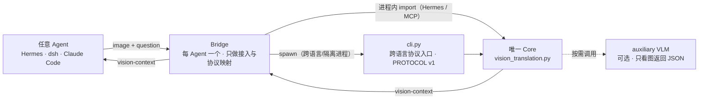

# Translation with Visual Primitives

> **一个稳定的视觉翻译 Core，任意 Agent 通过 Bridge 即插即用。**

本项目把图片翻译成结构化的 `<vision-context>` 文本：辅助 VLM 负责“看”，
Core 统一生成 `norm-1000 xyxy` 视觉基元、由几何计算得到的空间关系和 OCR；
主 Agent 只消费文本，不接触像素，也不需要修改自身模型。

项目名有意呼应 DeepSeek 的论文
[*Thinking with Visual Primitives*](https://arxiv.org/abs/2508.12952)：
论文让模型在内部用视觉基元思考，本项目则把方向反过来——在模型外部把视觉
**翻译**成基元，再交给原本的文本模型。

## 架构：一个 Core，任意 Agent，各自的 Bridge



图中的调用在实现上是往返的：Core 调用辅助 VLM，Bridge 调用 Core，最终
`<vision-context>` 经 Bridge 返回 Agent。Bridge 有两种合法接法：

- Python Bridge 可以直接导入 Core；Hermes 原生插件和 MCP Bridge 都这样做。
- 其他语言或隔离进程通过 `cli.py` 的 PROTOCOL v1 JSON 边界调用 Core。

```text
vision_translation.py   Core：唯一的视觉翻译逻辑，import-pure
cli.py                  跨语言协议入口：argv/stdin → 单个 JSON
__init__.py             Hermes 原生 Bridge（进程内）
adapters/mcp/           通用 MCP Bridge（进程内导入 Core）
adapters/_template/     社区 Bridge 模板（通过 CLI）
```

**核心不随 Agent 改变。** 新 Agent 不需要在 Core 中增加分支；社区只需贡献
一个薄 Bridge，把宿主的图片/问题交给既有 Core，再把结果映射回宿主。
Bridge 不得复制提示词、JSON 解析、框归一化、空间关系或 VLM 调用逻辑。

## 快速开始

### 直接使用 CLI

无需 Hermes。Core 运行时仅依赖 Python 标准库；Pillow 是可选的图片旋转和
缩放增强。

```bash
export OPENROUTER_API_KEY=sk-...
python cli.py path/to/image.jpg "What is the layout?"
```

stdout 始终只有一个 JSON 对象，日志只能写入 stderr：

```json
{
  "protocol": 1,
  "core_version": "<core_version>",
  "status": "ok",
  "context": "<vision-context>…</vision-context>",
  "model": "xiaomi/mimo-v2.5"
}
```

示例中的 `<core_version>` 是占位符；实际值以
`python cli.py --protocol-version` 输出为准，并由 CI 检查它与
`plugin.yaml` 一致。

`status` 为：

- `ok`：已得到视觉上下文，退出码 0；
- `unavailable`：无密钥、上游不可用或 VLM 输出无效等可预期降级，退出码 0；
- `error`：请求错误或内部错误，退出码 1–2。

完整契约见 [PROTOCOL.md](PROTOCOL.md)。以下握手命令不读取图片、不使用
Token、不访问网络，适合 CI：

```bash
python cli.py --self-check
python cli.py --protocol-version
```

### Hermes Agent 原生 Bridge

需要已配置 `OPENROUTER_API_KEY` 的 Hermes Agent。

```bash
# 推荐：从 GitHub 安装
hermes plugins install BingL-Li/vision-translation --enable

# 或手动放入用户插件目录
git clone https://github.com/BingL-Li/vision-translation ~/.hermes/plugins/vision-translation
hermes plugins enable vision-translation
```

安装后重启承载对话的 Hermes 进程，再验证：

```bash
hermes plugins list
hermes tools list
```

工具 `vision_translate`（toolset：`vision_translation`）参数如下：

| 参数 | 类型 | 说明 |
|---|---|---|
| `image_path` | string | 本地图片路径，必填 |
| `question` | string | 用于引导解析重点的可选问题 |
| `max_objects` | int | 保留的最大基元数，默认 12、上限 16 |

只需一句廉价描述时使用 Hermes 内置 `vision_analyze`；需要坐标、计数、相对
位置、UI/PCB 元素位置、结构化实体或 OCR 时使用 `vision_translate`。

### MCP Bridge

适用于 dsh、Claude Code、Cursor 等任意 MCP Host：

```bash
cd adapters/mcp
python -m venv .venv
.venv/bin/pip install -r requirements.txt
.venv/bin/python smoke_test.py
```

随后把 `adapters/mcp/server.py` 配置为 stdio MCP Server。dsh 可合并
`adapters/mcp/dsh-preset.yml`；Claude Code 和 Cursor 分别使用 `.mcp.json`
和 `~/.cursor/mcp.json`。完整配置见
[adapters/mcp/README.md](adapters/mcp/README.md)。

Hermes 用户应在原生插件与 MCP Bridge 中二选一，避免注册两个用途相同的工具。

### 端到端 Demo

```bash
python demos/vision_translate_demo.py path/to/image.jpg "What is the layout?"
```

Demo 额外演示把 `<vision-context>` 交给文本 LLM；生产集成只需 Bridge + Core，
Core 本身不会嵌套调用文本 LLM。

### 为其他 Agent 增加 Bridge

```bash
cp -r adapters/_template adapters/<your-agent>
```

实现宿主接入、补充 README 和离线 smoke test、登记到
[ADAPTERS.md](ADAPTERS.md)，即可提交 PR。详细流程见
[CONTRIBUTING.md](CONTRIBUTING.md)。

## 数据流

1. Bridge 接收 Agent 给出的图片路径、问题和可选参数。
2. Core 处理 EXIF 方向，并在 Pillow 可用时将长边限制为 1568 像素。
3. Core 把图片交给可配置的 OpenRouter 辅助 VLM（默认
   `xiaomi/mimo-v2.5`，可由 `VISION_TRANSLATE_VLM` 覆盖）。
4. Core 容错解析 JSON，校验并规范化对象框；坐标越界会被钳制并产生警告，
   零面积或非有限坐标会被丢弃。
5. Core 根据几何关系计算 `left_of / right_of / above / below / inside /
   overlaps`，而不是让 VLM 猜关系。
6. Core 渲染不超过 2000 字符的 `<vision-context>`；优先保留基元和关系，
   超限时先裁剪描述文本。
7. Bridge 将成功、不可用或错误状态转换成宿主 Agent 能理解的结果。

## 设计边界

- **统一坐标契约**：`norm-1000`、`xyxy`，左上角 `(0, 0)`，右下角
  `(1000, 1000)`。
- **诚实 Grounding**：坐标是 VLM 按提示生成，不是原生检测器输出，因此明确
  标记为 `grounding: prompted`。
- **几何而非语言关系**：方向关系只在两个框以 `EPS=20` 明确分离时产生，
  避免互相矛盾；包含和重叠也由框计算。
- **失败关闭**：三次无效 VLM 输出后返回 `unavailable`，绝不注入看似合理的
  空上下文或编造内容。失败路径最多会发送三次带图请求，需留意成本。
- **Core 可测试**：`vision_translation.py` 导入时无网络、无 argparse、无
  输出；测试可以在 HTTP 边界 Mock VLM。
- **Bridge 可扩展**：宿主生命周期、附件格式、工具协议属于 Bridge；视觉语义、
  解析和几何只属于 Core。
- **隐私边界**：图片会发送到配置的 OpenRouter VLM，不会发送给主文本模型；
  使用前应确认数据策略满足你的场景。

## 输出示意

```text
<vision-context>
<visual-primitives coord="norm-1000" box_order="xyxy" grounding="prompted">
- v1 | type: box | box: [86, 120, 420, 630] | ref: panel | confidence: 0.96 | grounding: prompted
- v2 | type: box | box: [610, 210, 900, 520] | ref: button | confidence: 0.93 | grounding: prompted
</visual-primitives>
<visual-relations>
- v1 left_of v2 | source: geometry | confidence: 1.0
</visual-relations>
visible_text: Submit
</vision-context>
```

## 仓库结构

```text
vision_translation.py       唯一 Core
cli.py                      PROTOCOL v1 跨语言入口
__init__.py                 Hermes 原生 Bridge
adapters/_template/         社区 Bridge 脚手架
adapters/mcp/               通用 MCP Bridge 与 dsh preset
demos/                      含文本 LLM 步骤的端到端演示
tests/                      离线 Core 与协议测试
PROTOCOL.md                 CLI 协议唯一规范
ADAPTERS.md                 Bridge 注册表与生态规则
CONTRIBUTING.md             贡献流程与两级维护边界
CHANGELOG.md                版本历史
```

## 局限

- Grounding 来自 VLM 提示而非原生检测器，适合布局、UI 和场景理解，但不保证
  像素级准确。
- 需要支持图片输入的 OpenRouter VLM；更换模型前应核对其
  `input_modalities`。
- 主模型需要能可靠理解坐标文本和空间关系；DeepSeek 系列是最初目标，但
  Core 与主 Agent 模型无关。
- MCP Bridge 当前接收本地文件路径；只提供内存附件且不共享文件系统的宿主
  需要自行增加原生 Bridge 或附件转换。

## 心路历程

这个项目并非从一张完整蓝图开始，而是从一篇论文、阅读开源实现的过程，以及
一个一直放不下的想法逐步长出来的。

**2026-07-10：想法出现。** 阅读 *Thinking with Visual Primitives* 时，最打动
我的并不是模型架构，而是表示方法：图片不一定以像素或散文式描述进入模型，
也可以变成少量带标签、位于统一坐标系中的视觉基元。论文把这种表示放进模型
内部；我的第一反应是把它反过来——既然基元最终可以是文本，翻译过程就能完全
位于模型外部。主模型无需改造，由另一个组件负责看图并交给它
`<vision-context>`。项目名由此而来。

**2026 年 7 月：寻找前人的路。** 动手前我先寻找类似工作，并在开源项目
**OpenHanako** 中看到了 `core/vision-bridge.ts`：它已经把图片转成包含
`<visual-primitives coord="norm-1000" box_order="xyxy" grounding="...">`
的 `<vision-context>`。这次阅读帮我避开了很多弯路，本项目有意沿用了：

- `<vision-context>` / `<visual-primitives>` 格式，以及每行
  `id | type | box | ref | confidence | grounding` 的表达；
- `norm-1000` + `xyxy` 这一套唯一坐标空间；
- 16 个基元、96 字符标签等保守上限；
- 最重要的 Grounding 模式：诚实区分原生检测坐标与 VLM 提示坐标。

因此这里始终写明 `grounding: prompted`，而不把辅助 VLM 伪装成检测器。
保持格式兼容也是有意为之：这里生成的上下文应尽可能被已理解该约定的工具读取。

**2026 年 7–8 月：把边界做窄。** 四个选择最终塑造了实现：

1. **结构优先于描述。** “哪个元素在提交框左边”需要稳定坐标，而不是每次措辞
   都可能变化的长描述。
2. **VLM 负责看，程序负责几何。** 让 VLM 同时判断关系容易产生 A 在 B 左边、
   B 又在 A 左边的矛盾；这里仅从框推导关系。
3. **不嵌套推理。** Core 到 `<vision-context>` 就停止，主模型自己思考；文本
   LLM 的二次调用只保留在 `demos/` 中。
4. **失败关闭。** 错误但可信的上下文比明确不可用更危险，所以连续无效输出会
   返回 `unavailable`，越界坐标也会显式写入 `vision_warnings:`。

同时，`vision_translation.py` 被保持为无导入副作用的纯函数库，使解析、
归一化和几何能脱离任何 Agent 测试，也让所有 Bridge 复用同一份 Core。

**2026-08-14：首次发布。** 项目以 Hermes Agent 插件 `0.1.0` 发布；同日完成
代码审查，删除死代码，加入坐标越界警告，并整理模块语言。

**2026-08-15：从插件走向生态。** PROTOCOL v1、`cli.py`、离线测试、
Bridge 模板、MCP Bridge、生态文档和 CI 逐步加入。仓库不再只是“一个 Hermes
插件”，而成为“一个 Core + 稳定边界 + 一圈 Bridge”。Hermes 仍是官方原生
Bridge，但不再是 Core 的前提。

下一步不是让 Core 感知更多 Agent，而是让社区为自己的 Agent 贡献 Bridge。
只要共同遵守协议和“不复制 Core”的规则，Agent 可以不断增加，核心保持不变。

## 致谢

- *Thinking with Visual Primitives* 的作者：这个项目建立在其视觉基元表示启发上。
- [OpenHanako](https://github.com/liliMozi/openhanako) 的作者和贡献者，尤其是
  `core/vision-bridge.ts` 的维护者：本项目的上下文格式、坐标契约和 Grounding
  诚实性来自对该实现的学习。
- Nous Research：Hermes Agent 插件系统承载了本项目最早的原生 Bridge。

实现中的任何错误都由本项目承担。

## 贡献与许可证

Core 变更采用高门槛审查，Bridge 贡献采用低门槛审查。详见
[CONTRIBUTING.md](CONTRIBUTING.md) 和 [ADAPTERS.md](ADAPTERS.md)。

MIT © 2026 Binglun Li。
