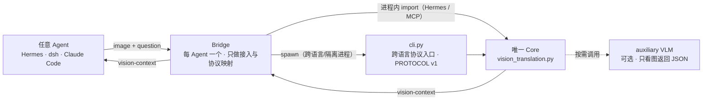

# 架构

一个 Core，任意 Agent，各自的 Bridge。

## 每部分只做一件事

| 部分 | 职责 |
|---|---|
| Agent | 发图 + 问题，收 vision-context 文本 |
| Bridge | 接入、协议与状态映射，零业务逻辑 |
| cli.py | Core 的跨语言协议入口（PROTOCOL v1，stdin b64） |
| Core | 全部视觉翻译逻辑：VLM JSON → 基元 → 几何 → 文本 |
| VLM | 看图，返回结构化 JSON |

Core 内部流水线：`image → VLM JSON → 规范化基元 norm-1000 xyxy → 几何关系 → <vision-context>`

> 铁律：核心逻辑只在 Core；新增 Agent = 新增一个 Bridge，永不改 Core。
