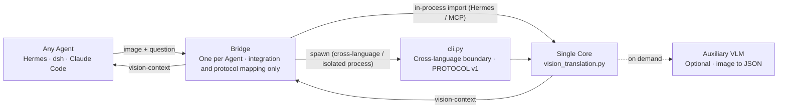

# Architecture

One stable Core supports any Agent through a dedicated Bridge.

# 架构

一个稳定的 Core 通过各自的 Bridge 支持任意 Agent。

## One responsibility per layer

| Layer | Responsibility |
|---|---|
| Agent | Sends an image and question; receives `vision-context` text |
| Bridge | Handles integration, protocol, and status mapping; no vision logic |
| `cli.py` | Cross-language Core boundary (`PROTOCOL v1`, stdin Base64) |
| Core | VLM JSON → primitives → geometry → text |
| VLM | Looks at the image and returns structured JSON |

每一层只负责一件事

| 层 | 职责 |
|---|---|
| Agent | 发送图片和问题，接收 `vision-context` 文本 |
| Bridge | 处理接入、协议和状态映射，不包含视觉逻辑 |
| `cli.py` | Core 的跨语言边界（`PROTOCOL v1`、stdin Base64） |
| Core | VLM JSON → 基元 → 几何 → 文本 |
| VLM | 查看图片并返回结构化 JSON |

The Core pipeline is: `image → VLM JSON → normalized norm-1000 xyxy primitives → geometric relations → <vision-context>`.

Core 的内部流水线是：`image → VLM JSON → 规范化的 norm-1000 xyxy 基元 → 几何关系 → <vision-context>`。

> **Rule:** Core logic lives only in the Core. Adding an Agent means adding a Bridge, never changing the Core.

> **铁律：** 核心逻辑只存在于 Core；新增 Agent 就新增 Bridge，永远不要修改 Core。
